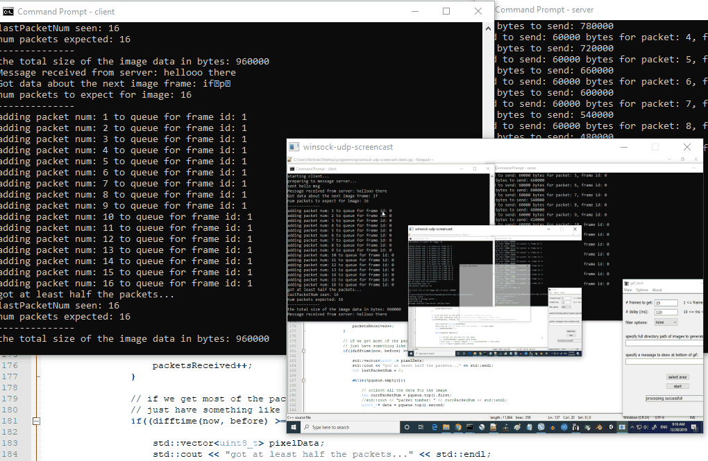

a simple screencast application (client and server) with SDL2 and Winsock. The server is to be run on the machine whose screen is to be broadcasted, which takes a screenshot every second.    
     
right now it seems to work fairly well, but the client window is set to be at 600 x 400 size and it's lacking a menu page to input the ip of the server, which are some things I'd like to modify. I haven't tested with multiple clients either and I also don't have a reliable UDP set up and have a poor messaging system set up + no respect for byte order between network and host (but packet loss doesn't seem too significant when testing locally), which are some additional things to address later.    
    
    