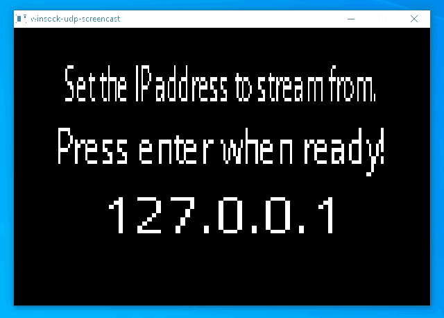

A simple screencast application (client and server) with SDL2 and Winsock. The server is to be run on the machine whose screen is to be broadcasted, which takes a screenshot every second.    
     
Currently it seems to work fairly well, but the client window is set to be at 600 x 400 size, which is something to fix. I also haven't tested with multiple clients and I also don't have a reliable UDP set up and have a poor messaging system set up + no respect for byte order between network and host (but packet loss doesn't seem too significant when testing locally), which are some additional things to address later. There is a basic menu screen that allows the user to input the ip address of a computer to stream from (i.e. the server).
    
   
    