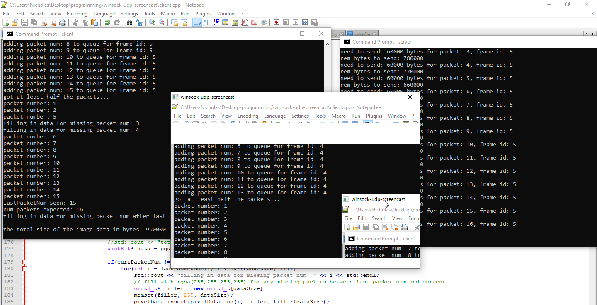

a simple screencast application (client and server) with SDL2 and Winsock.   
     
right now it seems to work fairly well, but I still only have the dimensions of the screen 600 x 400 hardcoded and don't have a menu page to input the ip of the server, which are some things I'd like to modify. I also don't have a reliable UDP set up (and have a poor messaging system set up + no respect for byte order between network and host), but packet loss doesn't seem too significant when testing locally, which are some additional things to address later.    
    
    